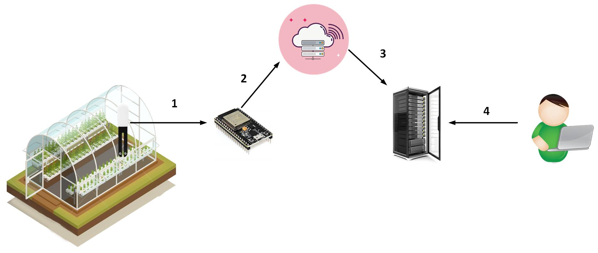
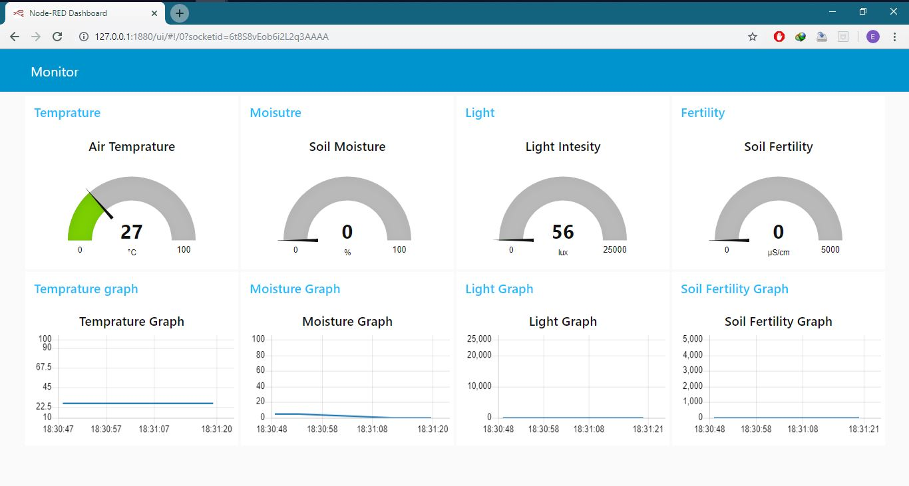

In this system I'm using :
1. Xiaomi MiFlora as sensing device. This device can sensing air temprature, soil moisture, light intesity and soil fertility
2. ESP32 to get data from MiFlora using BLE then publish it to cloud using MQTT (Using the code from [https://github.com/sidddy/flora](https://github.com/sidddy/flora) with adjustment with my device)
3. CloudMQTT as the cloud
4. Node-Red in server to subscribe data from CloudMQTT and display the dashboard

For the workflow of the system I'll describe using image below

1. MiFlora sensing the condition in soil then send the data to ESP32 using BLE
2. ESP32 recieve the data then publish it to CloudMQTT
3. Using Node-Red, server subscribe the data from CloudMQTT then process it to visualizes it in dashboard
4. User access the server using the server's IP to see the dashboard monitor of the condition of the soil in the greenhouse

Screenshot of the dashboard

